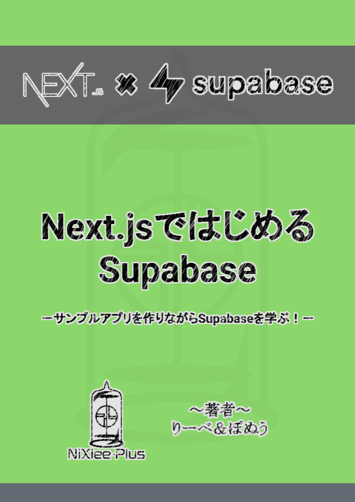

# Next.jsではじめるSupabase

[技術書典11](https://techbookfest.org/)で頒布した書籍「[Next.jsではじめるSupabase](https://techbookfest.org/product/5379695388393472?productVariantID=4808144628744192)」のサンプルコードリポジトリです。
本書では、サンプルWebアプリを実装しながら、Supabaseでできることを一つひとつ学べるようになっています。

購入はこちらから

- [技術書典オンラインマーケット](https://techbookfest.org/product/5379695388393472?productVariantID=4808144628744192)
- [BOOTH](https://booth.pm/ja/items/3184415)

## 作成するサンプルアプリ

実際に本書で作成するサンプルアプリは以下のURLで公開しています。

[https://techbookfest11.nixiee.plus](https://techbookfest11.nixiee.plus)

### アプリの概要

所有している漫画を一覧できるWebアプリです。
[楽天ブックス書籍検索API](https://webservice.rakuten.co.jp/api/booksbooksearch/)や[openBD](https://openbd.jp/)を使用し、簡単に書籍を登録できます。

### サンプルアプリの使い方

- アカウントを作成し、ログイン
  - メールアドレス、マジックリンク、GitHubアカウントによるログインをサポート
- 「ADD NEw」をクリックし、追加した漫画のタイトル・著者を入力して「Add」
- 登録した漫画をクリックした後、「ADD NEW」をクリックし、各巻の情報を登録
  - "Volume"に巻数、"ISBN"にISBN(国際的な書籍の識別子)を入力
  - ISBNは漫画タイトルにより検索可能
  - "Possession"にチェックを入れると所持している状態になり、サムネイルがカラー表示されます

## 使用している主なパッケージ

- [Next.js](https://nextjs.org/)
- [TypeScript](https://www.typescriptlang.org/)
- [TailwindCSS](https://tailwindcss.com/)
- [Supabase](https://supabase.io/)
- [Supabase UI](https://ui.supabase.io/)
- [Headless UI](https://headlessui.dev/)

## タグについて

本書では、開発段階のサンプルコードを実行できるように、書籍の節ごとにタグを付与しています。
[Releasesページ](https://github.com/NiXieePlus/supabase-manga-list-sample/releases)からご確認下さい。

## 本書に関するご意見・ご感想・ご指摘

以下のいずれかの方法でご連絡いただけると幸いです。

- Twitter
  - 著者へメンション([りーべ](https://twitter.com/MagicalLiebe)・[ぽぬう](https://twitter.com/ponu77))
  - ハッシュタグ [#supabase_nixiee](https://twitter.com/intent/tweet?hashtags=supabase_nixiee)を付けてツイート
- GitHub
  - Issuesに投稿

## 正誤表

本書に関する修正についてもこちらのリポジトリにて掲載いたします。

正誤表は[こちら](book/errata.md)
